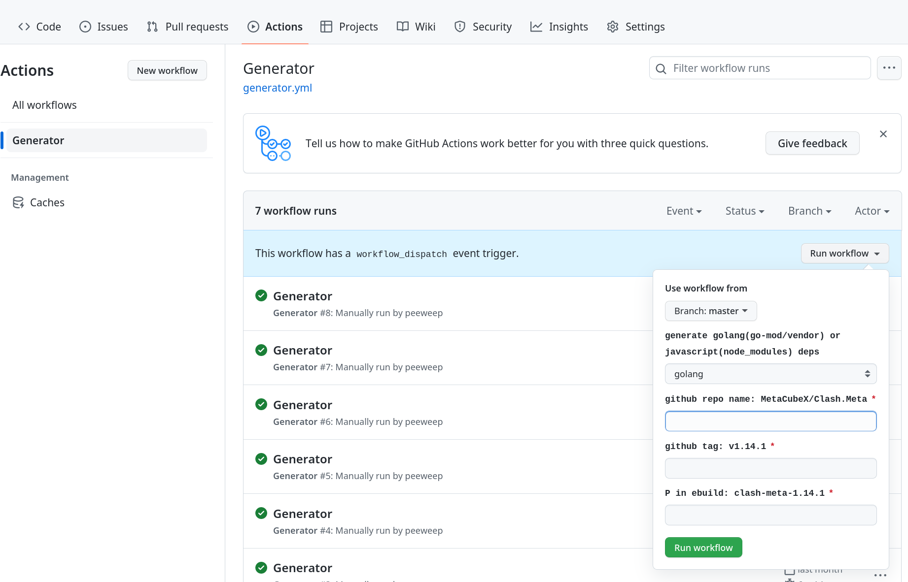

You can use this workflow generate gentoo deps tarball

Support:

 - Golang: `${P}-deps.tar.xz` and `${P}-vendor.tar.xz`
 - Javascript: `${P}-node_modules.tar.xz`
 - rust: `${P}-crates.tar.xz`

How to use this?

 - Step 1: Fork this repo

 - Step 2: manual trigger workflow:

